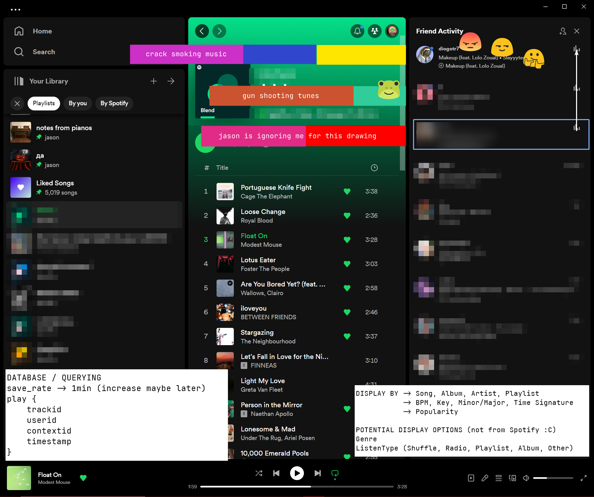

# `spotispy`
<sup><i>shut up its clever</i></sup>

## `DISCLAIMER`
This is a proof-of-concept ONLY and is NOT AT ALL intended to be used in any way shape or form.  
It is a hacky, dirty, and probably insecure way of doing things. It is also not very well written.  
IT MAY BREAK SPOTIFY TERMS OF SERVICE.  
**It is therefore a proof-of-concept ONLY.**  

## Concept

Quick and dirty data visualization of how this application could work / look.   



### Authentication
Unfortunately we can't go the normal route here because the endpoint for the `buddylist` feature is internal / not public. So we have to do some hacky stuff to get to it.
```
1. Get `sp_dc` cookie from web Spotify app 
     via ripping cookie from 'https://open.spotify.com/'
2. Get `bearer token` by exchanging `sp_dc` cookie
     via 'https://open.spotify.com/get_access_token?reason=transport&productType=web_player'
3. Get fwiend listen data
     via 'https://spclient.wg.spotify.com/presence-view/v1/buddylist'
```

### Data Storage
```
query_rate -> 1min 

play {
    trackid
    userid
    contextid
    timestamp
}
```


### Display Types
```
DISPLAY BY -> Song, Album, Artist, Playlist
           -> BPM, Key, Minor/Major, Time Signature
           -> Popularity

POTENTIAL DISPLAY OPTIONS (not from Spotify :C)
Genre 
ListenType (Shuffle, Radio, Playlist, Album, Other)
```